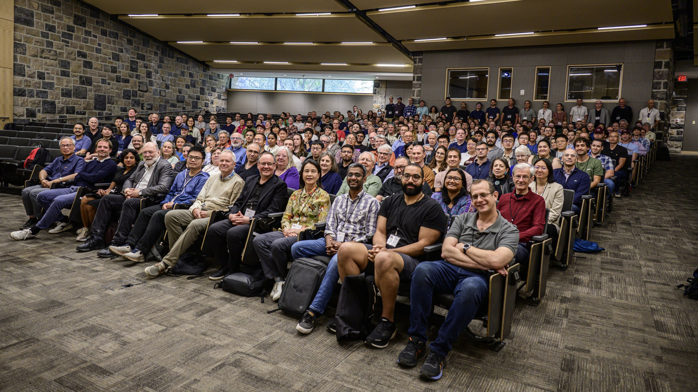
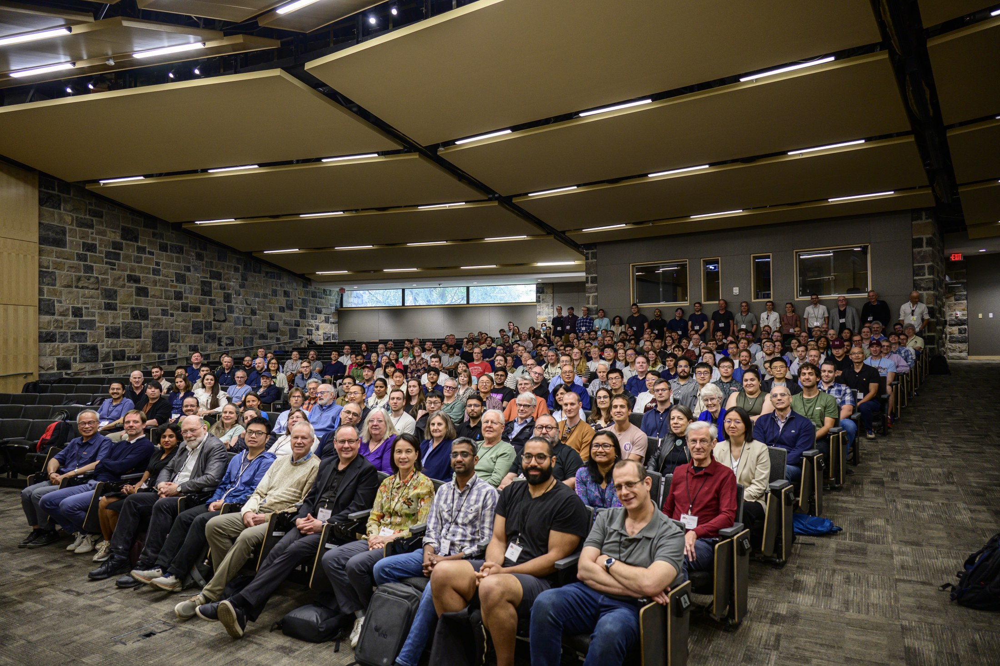



## Overview

I will give a minisymposium talk at the 27th Conference of the International Linear Algebra Society (ILAS 2026) in the session **Theoretical Advances in Operator Learning**.

## Event Details

- **Conference:** [27th Conference of the International Linear Algebra Society (ILAS 2026)](https://indico.math.vt.edu/event/2/)
- **Date:** Tuesday, **May 19, 2026**
- **Time:** **2:50 PM Eastern**
- **Duration:** **25 minutes**
- **Location:** **McBryde Hall 113, Virginia Tech**
- **Session:** **Theoretical Advances in Operator Learning**
- **Talk page:** https://indico.math.vt.edu/event/2/contributions/100/

## Talk

**Title**  
*Learning Enhanced Ensemble Filters: Continuum Limits of Attention on Measures*

This talk is about using learnable operators on probability measures to improve ensemble filtering methods for data assimilation. Classical ensemble Kalman filtering is efficient and widely used, but its Gaussian approximation can struggle in nonlinear and non-Gaussian regimes. The method I will discuss replaces part of this update with a measure neural mapping, implemented through set-transformer architectures, so that the learned update acts naturally on ensembles viewed as empirical probability measures.

A main point of the talk is the theoretical connection between finite ensembles and their continuum limit. In particular, attention layers applied to empirical measures can be related to attention operators acting directly on probability measures, with convergence in Wasserstein distance as the ensemble size grows. This gives a mathematical explanation for why one learned parameterization can be useful across different ensemble sizes. I will also describe numerical results on chaotic dynamical systems such as Lorenz-96 and Kuramoto-Sivashinsky.

## Conference Photos

These are group photos from this year's ILAS 2026 meeting at Virginia Tech.

## About ILAS 2026

ILAS 2026 is the 27th Conference of the [International Linear Algebra Society](https://ilasic.org/who-we-are/). It will be held May 18-22, 2026, on the campus of Virginia Tech in Blacksburg, Virginia. The conference theme, **Linear Algebra on the Blue Ridge: Panoramas of Theory and Application**, reflects a broad program spanning linear algebra theory, numerical analysis, applications, and linear algebra education.
