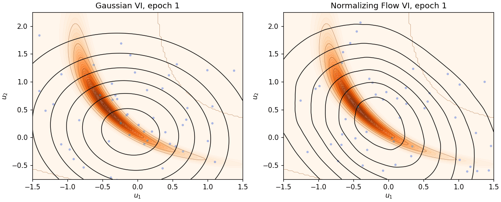



  

## Overview

I wrote a detailed GitHub repository of demo notebooks for the textbook **Machine Learning for Inverse Problems and Data Assimilation**:

- **Repository:** [wispcarey/ML_for_IP_and_DA](https://github.com/wispcarey/ML_for_IP_and_DA)
- **Textbook:** [Machine Learning for Inverse Problems and Data Assimilation](https://arxiv.org/abs/2410.10523)

The repository is designed to make the mathematical and algorithmic ideas in the textbook more concrete through executable examples. Each notebook is written as a self-contained demonstration, with references to the relevant textbook chapters and sections.

## What the Repository Contains

The codebase contains a collection of textbook-ready Jupyter notebooks covering both inverse problems and data assimilation, with an emphasis on how modern machine learning methods interact with classical Bayesian and filtering ideas.

The demos include:

- A basic PyTorch machine learning pipeline, including supervised learning, model training, checkpointing, and diagnostics.
- Introductory Bayesian inverse problems, including priors, likelihoods, posteriors, MAP estimation, and image reconstruction examples.
- Classical posterior sampling methods, including importance sampling, Markov chain Monte Carlo, and ensemble Kalman inversion.
- Variational posterior approximation and transport-map-based posterior sampling.
- Amortized posterior sampling with conditional normalizing flows and energy-distance objectives.
- Data assimilation basics, including Kalman filtering, particle filters, ensemble Kalman filters, and filtering diagnostics.
- Lorenz-63 and Lorenz-96 examples for parameter estimation, learned regularization, learned gains, model-error learning, and ensemble transport filtering.

## How to Use It

The notebooks are intended to be interactive. They can be read alongside the textbook or opened directly in Google Colab from the repository README.

For Colab, I recommend using a high-RAM runtime with a GPU accelerator. A standard T4 or L4 GPU should be sufficient for the intended experiments.

The repository currently follows the chapter and section references from version 2 of the textbook, dated October 6, 2025.

## Relation to Other Materials

Some materials in the repository are based on the **ML for IP and DA winter school in Amsterdam**, whose original resources are available here:

- [baptistar/MLforIPDA](https://github.com/baptistar/MLforIPDA)

My goal with [wispcarey/ML_for_IP_and_DA](https://github.com/wispcarey/ML_for_IP_and_DA) is to provide a detailed, organized, and executable companion to the textbook, especially for readers who want to move back and forth between mathematical formulations and working code.

The notebooks may still contain small mistakes. If you find an issue, please feel free to contact me or open a GitHub issue.
