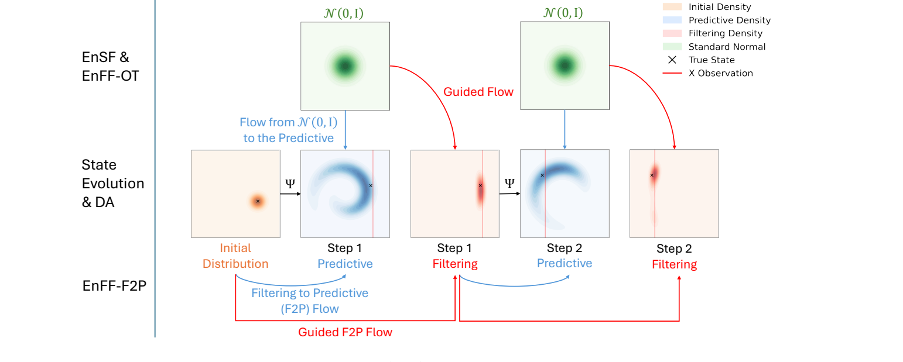
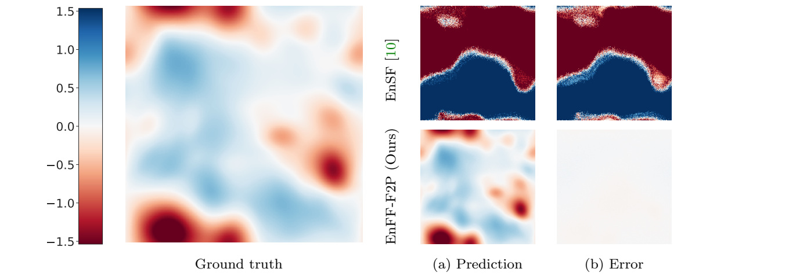
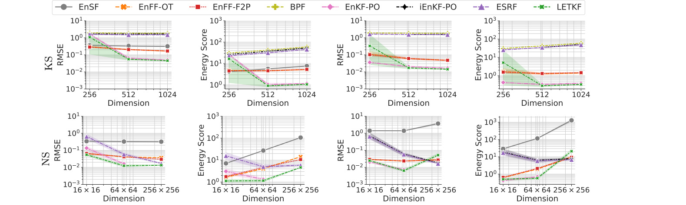



I am happy to share that our paper, **“Flow Matching for Efficient and Scalable Data
Assimilation,”** has been **accepted for publication in the SIAM/ASA Journal on
Uncertainty Quantification**.

- **Paper:** [arXiv](https://arxiv.org/abs/2508.13313) · [local PDF](/publication/transue-flow-2025/Flow%20Matching%20for%20Efficient%20and%20Scalable%20Data%20Assimilation.pdf)
- **Code:** [Utah-Math-Data-Science/Data-Assimilation-Flow-Matching](https://github.com/Utah-Math-Data-Science/Data-Assimilation-Flow-Matching)
- **Publication page and BibTeX:** [Flow Matching for Efficient and Scalable Data Assimilation](/publication/transue-flow-2025/)
- **Journal:** [SIAM/ASA Journal on Uncertainty Quantification](https://www.siam.org/publications/siam-journals/siam-asa-journal-on-uncertainty-quantification/)

## Why Flow Matching for Data Assimilation?

Data assimilation combines a dynamical model with noisy observations to estimate a
system's evolving state. Classical ensemble filters are efficient but can struggle
with nonlinear or non-Gaussian distributions. More expressive generative approaches
can address those settings, but methods such as the ensemble score filter require many
sampling steps and can become expensive in large systems.

Our goal was to retain the expressiveness of a generative method while making the
sampling process faster, training-free, and easier to scale.

## The Ensemble Flow Filter

<figure style="margin: 1.5rem 0; text-align: center;">
  
  <figcaption style="margin-top: 0.6rem;">EnFF transports an ensemble through a guided flow. The F2P variant directly connects one filtering distribution to the next predictive distribution instead of repeatedly returning to a Gaussian reference.</figcaption>
</figure>

We introduce the **ensemble flow filter (EnFF)**, a flow-matching framework for
sequential Bayesian data assimilation. It does not require an offline training stage.
Instead, it constructs a Monte Carlo estimate of the marginal flow field from the
current ensemble and incorporates each observation through localized guidance.

A central ingredient is the **filtering-to-predictive (F2P) flow**. Standard generative
filters repeatedly transport samples from a Gaussian reference distribution. F2P
instead starts from the previous filtering ensemble and transports it toward the next
predictive distribution. This uses the structure already present in Bayesian filtering,
producing a more direct path and more stable behavior when the number of sampling steps
is small.

The framework also connects new generative filters with classical methods. Under
appropriate flow choices and assumptions, EnFF recovers the bootstrap particle filter
and the ensemble Kalman filter.

## Accuracy, Efficiency, and Scale

We evaluate EnFF on Lorenz-63, Lorenz-96, the one-dimensional
Kuramoto–Sivashinsky equation, and the two-dimensional Navier–Stokes equations, using
both identity and nonlinear observation operators. The experiments range from compact
chaotic systems to a Navier–Stokes pressure field on a **256×256 grid**.

<figure style="margin: 1.5rem 0; text-align: center;">
  
  <figcaption style="margin-top: 0.6rem;">On the 256×256 Navier–Stokes benchmark, EnFF-F2P closely reconstructs the pressure field with only ten sampling steps, while EnSF shows a much larger error.</figcaption>
</figure>

The results show that EnFF can match or improve the ensemble score filter while using
far fewer sampling steps, with the advantage becoming more pronounced as the sampling
budget decreases. EnFF-F2P is also less sensitive to its flow hyperparameters across
different step counts.

<figure style="margin: 1.5rem 0; text-align: center;">
  
  <figcaption style="margin-top: 0.6rem;">Accuracy across increasing Kuramoto–Sivashinsky and Navier–Stokes dimensions under identity and nonlinear observations. EnFF variants remain competitive as the state dimension grows.</figcaption>
</figure>

Across the high-dimensional benchmarks, EnFF offers a favorable balance of filtering
accuracy, distributional quality, runtime, and stability. These results suggest that
flow design—not only the choice of generative model—is a useful lever for building
practical data-assimilation algorithms.

## Collaboration and Reproducibility

This work was a rewarding collaboration with **Taos Transue**, **So Takao**, and
**Bao Wang**. Taos Transue and I contributed equally. The accompanying
[repository](https://github.com/Utah-Math-Data-Science/Data-Assimilation-Flow-Matching)
contains the implementation and experiment code.

*Figures on this page were extracted from the latest version of the paper.*
