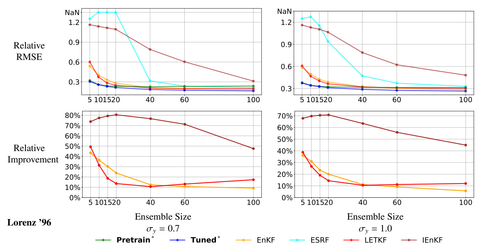
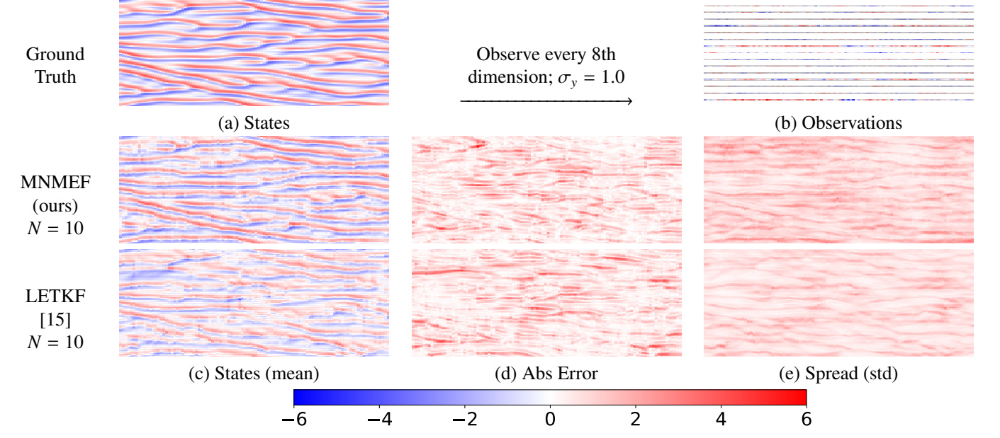
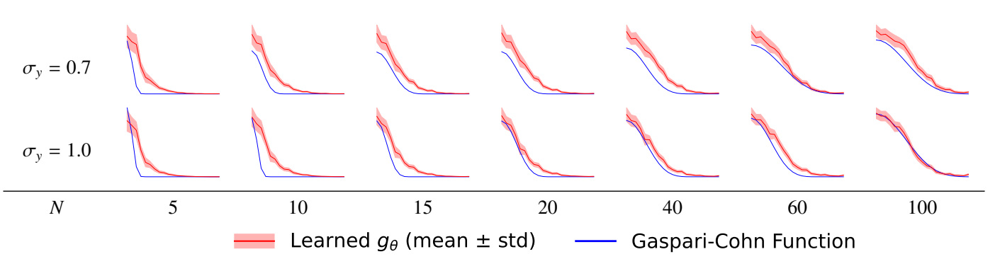

Our paper, **“Learning Enhanced Ensemble Filters,”** has been published in the
**Journal of Computational Physics**.

- **Journal article:** [ScienceDirect](https://www.sciencedirect.com/science/article/pii/S0021999125008320)
- **Paper:** [local PDF](/publication/bach-learning-2025/Learning%20Enhanced%20Ensemble%20Filters.pdf) · [arXiv](https://arxiv.org/abs/2504.17836)
- **Code:** [wispcarey/DALearning](https://github.com/wispcarey/DALearning)
- **Publication page and BibTeX:** [Learning Enhanced Ensemble Filters](/publication/bach-learning-2025/)
- **Original announcement:** [Eviatar Bach’s LinkedIn post](https://www.linkedin.com/feed/update/urn:li:activity:7404946216607961088/)

The paper introduces the **measure neural mapping enhanced ensemble filter (MNMEF)**.
Starting from a mean-field formulation of filtering, we use a set transformer to learn
corrections to ensemble filtering updates while respecting the permutation symmetry of an
ensemble. The mean-field perspective allows a model trained at one ensemble size to be
deployed at another, with lightweight fine-tuning for ensemble-size-dependent parameters.

<figure style="margin: 1.5rem 0; text-align: center;">
  
  <figcaption style="margin-top: 0.6rem;">Lorenz-96 results across ensemble sizes and two observation-noise levels. The pretrained and fine-tuned MNMEF models remain competitive as the ensemble size changes.</figcaption>
</figure>

Across Lorenz-63, Lorenz-96, and Kuramoto–Sivashinsky experiments, MNMEF improves on
optimized classical ensemble filters over a range of ensemble sizes.

<figure style="margin: 1.5rem 0; text-align: center;">
  
  <figcaption style="margin-top: 0.6rem;">Kuramoto–Sivashinsky filtering with only every eighth dimension observed. With an ensemble of ten members, MNMEF produces a more accurate state estimate than the optimized LETKF benchmark while maintaining a comparable spread.</figcaption>
</figure>

The method also learns ensemble-size-dependent inflation and localization during the
lightweight fine-tuning stage. Although the localization function is not constrained to have
a prescribed shape, it learns a distance-decay profile similar to the widely used
Gaspari–Cohn function.

<figure style="margin: 1.5rem 0; text-align: center;">
  
  <figcaption style="margin-top: 0.6rem;">Learned localization weights across ensemble sizes. The red curves adapt across assimilation steps, while the blue Gaspari–Cohn reference remains fixed.</figcaption>
</figure>

I led this work in collaboration with **Eviatar Bach**, **Ricardo Baptista**,
**Edoardo Calvello**, and **Andrew Stuart**.

The final article appears in **Journal of Computational Physics, Volume 547, Article
114550**: [https://doi.org/10.1016/j.jcp.2025.114550](https://doi.org/10.1016/j.jcp.2025.114550).
