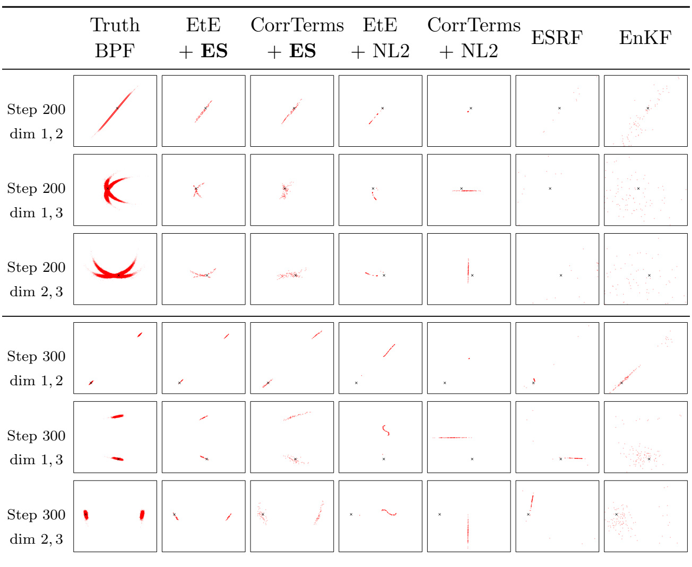
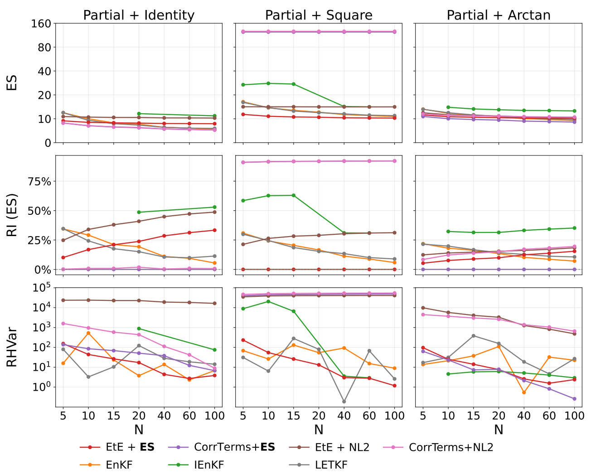



Our new paper, **“Learning Probabilistic Filters with Strictly Proper Scoring Rules,”**
is now available on arXiv and has been **submitted to the Journal of Machine Learning
Research (JMLR)**.

- **Paper:** [arXiv](https://arxiv.org/abs/2606.26497) · [local PDF](/publication/bach-probabilistic-2026/Learning-Probabilistic-Filters-with-Strictly-Proper-Scoring-Rules.pdf)
- **Code:** [wispcarey/Proper-Scoring-Ensemble-Filter](https://github.com/wispcarey/Proper-Scoring-Ensemble-Filter)
- **Publication page and BibTeX:** [Learning Probabilistic Filters with Strictly Proper Scoring Rules](/publication/bach-probabilistic-2026/)
- **Original announcement:** [Eviatar Bach’s LinkedIn post](https://www.linkedin.com/posts/eviatarbach_our-new-preprint-on-learning-probabilistic-activity-7476267345284550656-JM_d)

## Learning a Distribution Without Seeing It

Bayesian filtering aims to infer the evolving distribution of a hidden state from partial
and noisy observations. That full distribution—not only its mean—is what represents
uncertainty, multimodality, and the range of plausible system states.

This creates a basic learning problem: the true filtering distribution is generally
intractable, so it is not available as a supervised target. A simulator can readily produce
state trajectories and their corresponding noisy observations, but it does not hand us the
conditional distribution we would like a filter to learn.

Our solution is to change the training objective. A **strictly proper scoring rule** evaluates
a predictive distribution against a realized state, and its expected score is uniquely
optimized by the true data-generating distribution. We use the **energy score**, which lets
us train from simulated state–observation trajectories while still targeting the entire
Bayesian filtering distribution.

## The Proper Scoring Ensemble Filter

We introduce the **proper scoring ensemble filter (PSEF)**. Its learned analysis map takes
a forecast ensemble and the latest observation, then outputs an updated analysis ensemble.
The map is implemented with a permutation-invariant transformer, respecting the fact that
an ensemble represents an unordered empirical distribution. The same parameterization can
also operate across different ensemble sizes, with lightweight fine-tuning where needed.

The paper studies two ways to parameterize the update:

- **Correction terms:** retain the EnKF update as an inductive bias and learn how to
  correct it.
- **End to end:** learn a more flexible analysis map without constraining it to an
  EnKF-style correction.

The distinction matters. In close-to-Gaussian settings, the EnKF structure is useful and the
correction-based approach performs best. When the observation creates a strongly
non-Gaussian or multimodal posterior, the end-to-end map has the flexibility needed to
represent its geometry.

## Why the Loss Function Matters

The header figure gives a controlled example on the doubling-angle model. The true
posterior is bimodal. Training the same learning architecture with the energy score captures
both modes across ensemble sizes, including ensembles much smaller than those used by the
classical baselines. A normalized mean-squared objective and Kalman-type filters instead
miss the distributional structure, because matching a conditional mean is not enough to
learn uncertainty.

The theory mirrors this empirical difference. Under a realizability assumption, the
population proper-scoring objective is minimized by the true Bayesian filtering
distribution. We also connect the finite-ensemble, single-trajectory loss used in training to
the population objective through a mean-field consistency and time-averaging argument.

## Non-Gaussian Filtering in Lorenz Systems

<figure style="margin: 1.5rem 0; text-align: center;">
  
  <figcaption style="margin-top: 0.6rem;">Lorenz-63 with a partial square observation. The end-to-end, energy-score-trained PSEF most closely follows the particle-filter reference, including its cross-shaped and bimodal structures.</figcaption>
</figure>

We evaluate PSEF on a linear–Gaussian diagnostic, the doubling-angle model, Lorenz-63,
and Lorenz-96. In Lorenz-63, squaring the observed coordinate introduces sign ambiguity
and produces complex non-Gaussian filtering distributions. The end-to-end PSEF trained
with the energy score reproduces these structures more faithfully than mean-based learned
filters and classical Gaussian ensemble filters.

<figure style="margin: 1.5rem 0; text-align: center;">
  
  <figcaption style="margin-top: 0.6rem;">Lorenz-96 results across identity, square, and arctangent observations. Proper-score-trained filters remain among the strongest methods, while the best architecture depends on the posterior geometry.</figcaption>
</figure>

The Lorenz-96 results reinforce that there is no single architectural bias that is optimal
for every problem. Correction terms are effective when the filtering distribution remains
approximately unimodal, whereas the end-to-end energy-score model is strongest when the
observation induces multimodality. Across both cases, probabilistic training is what allows
the learned ensemble to target distributional accuracy rather than only state-estimation
error.

## Collaboration and Reproducibility

I led this project, including the implementation and numerical experiments, in collaboration
with **Eviatar Bach**, **Ricardo Baptista**, **Jochen Bröcker**, and **Andrew Stuart**.
The [project repository](https://github.com/wispcarey/Proper-Scoring-Ensemble-Filter)
contains the code and experiment scripts.

*Figures on this page were extracted from the paper, which is available under a CC BY 4.0 license.*
