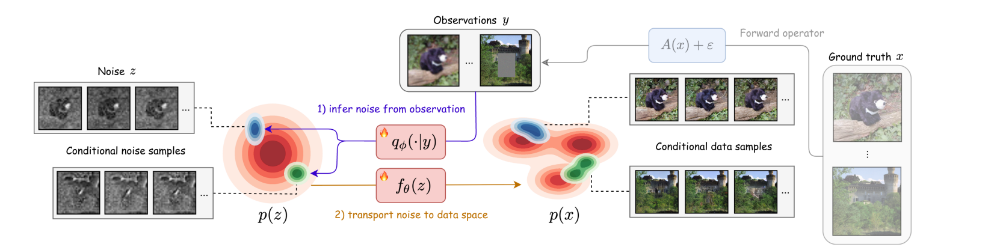
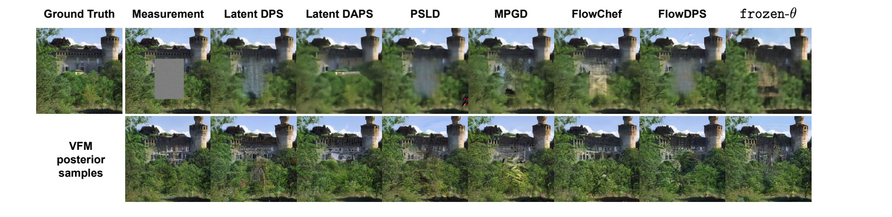



**Update:** Our paper, **“Variational Flow Maps: Make Some Noise for One-Step Conditional Generation,”** has been accepted to the main track of **ICML 2026** as a poster.

- **Paper:** [arXiv](https://arxiv.org/abs/2603.07276) · [local PDF](/publication/mammadov-variational-2026/Variational-Flow-Maps.pdf)
- **Code and checkpoints:** [abbasmammadov/VFM](https://github.com/abbasmammadov/VFM)
- **Publication page and BibTeX:** [Variational Flow Maps](/publication/mammadov-variational-2026/)
- **Original announcement:** [Abbas Mammadov’s LinkedIn post](https://www.linkedin.com/posts/abbas-mammadov_machinelearning-deeplearning-generativeai-activity-7437224909791158273-mcB9)

## The Problem: Fast Generation Is Hard to Condition

Flow maps can turn noise into a high-quality image in one forward pass. That makes them dramatically faster than iterative diffusion models, but it also removes the trajectory normally used to inject measurements, constraints, or rewards.

For an inverse problem, we observe a degraded image—perhaps blurred, masked, or downsampled—and want samples that are both consistent with that observation and plausible under the learned image prior. Diffusion methods can repeatedly guide an evolving sample toward the observation. A one-step flow map has no intermediate states to steer: once its initial noise is fixed, its output is fixed too.

VFM addresses this “guidance gap” by changing the question. Instead of asking how to guide the sampling path, we ask:

> What is the right noise distribution to start from?

## The Key Idea: Learn the Right Noise

<figure style="margin: 1.5rem 0; text-align: center;">
  
  <figcaption style="margin-top: 0.6rem;">Given an observation, a noise adapter produces conditional noise samples; the jointly trained flow map transports them to conditional data samples in one step.</figcaption>
</figure>

Given an observation or condition, VFM uses a lightweight **noise adapter** to predict a distribution in latent noise space. A sample from this distribution is then decoded by the flow map in a single forward pass.

The adapter and flow map are trained jointly with a variational objective. This joint training is essential: a simple Gaussian adapter may be too limited when paired with a frozen generator, but the flow map can reshape the noise-to-data coupling so that the same simple adapter represents a complex, multimodal posterior in data space. In a linear-Gaussian setting, our analysis shows that joint training recovers the exact posterior mean, whereas separate training is generically biased.

We also connect the data-reconstruction term in the variational objective to the mean-flow loss. That structural constraint keeps generated samples near the learned data manifold and avoids the off-manifold failure mode seen when the adapter and generator are optimized without a flow-map constraint.

## One Model, Multiple Inverse Problems

The adapter can be conditioned on the inverse-problem class, allowing a single model to amortize inference across denoising, random and box inpainting, super-resolution, Gaussian deblurring, and motion deblurring.

<figure style="margin: 1.5rem 0; text-align: center;">
  
  <figcaption style="margin-top: 0.6rem;">ImageNet 256×256 box inpainting. The lower row shows distinct VFM posterior samples that remain consistent with the visible image.</figcaption>
</figure>

On ImageNet 256×256 inverse problems, VFM combines distributional quality with a large speed advantage:

- For box inpainting, one-step VFM reaches an FID of **33.34**, compared with **62.35–75.62** for the iterative guidance baselines reported in the paper.
- VFM uses **1 neural function evaluation**, while those baselines use **250×2** evaluations with classifier-free guidance.
- A single VFM sample takes about **0.025–0.027 seconds** in our experiments, versus roughly **7–47 seconds** for the iterative methods.
- VFM performs strongly on distributional and calibration metrics including **FID, MMD, CRPS, and LPIPS**.

There is an important evaluation lesson here. For posterior sampling, diversity and calibration matter alongside pixel-wise fidelity. PSNR and SSIM often reward posterior-mean-like, smoother reconstructions, so they do not by themselves capture whether a method produces the right distribution of plausible solutions. Averaging several VFM draws improves these pixel-wise metrics, while the individual draws expose meaningful posterior uncertainty.

## Beyond Inverse Problems: One-Step Reward Alignment

The same idea extends naturally from observations to general differentiable rewards. VFM learns a context-dependent noise adapter while fine-tuning the flow map toward a reward-tilted distribution. In our experiments, strong reward alignment emerges in less than half an epoch of fine-tuning, and the resulting model still generates with a single forward pass. The uncurated reward-aligned samples shown in this post's header were generated by that fine-tuned flow map.

## Code and Reproducibility

The [official repository](https://github.com/abbasmammadov/VFM) includes the training and sampling code, released checkpoints, scripts for the ImageNet inverse problems, and a small checkerboard example that illustrates how joint training changes the latent coupling. The conditional sampler supports one-step generation as well as two-to-four-step refinement.

This work was a wonderful collaboration among **Abbas Mammadov**, **So Takao**, **Bohan Chen**, **Ricardo Baptista**, **Morteza Mardani**, **Yee Whye Teh**, and **Julius Berner**, spanning the University of Oxford, Caltech, PhysicsX, the University of Toronto, and NVIDIA. Abbas Mammadov and So Takao contributed equally.

*Figures on this page were extracted from the paper, which is available under a CC BY 4.0 license.*
